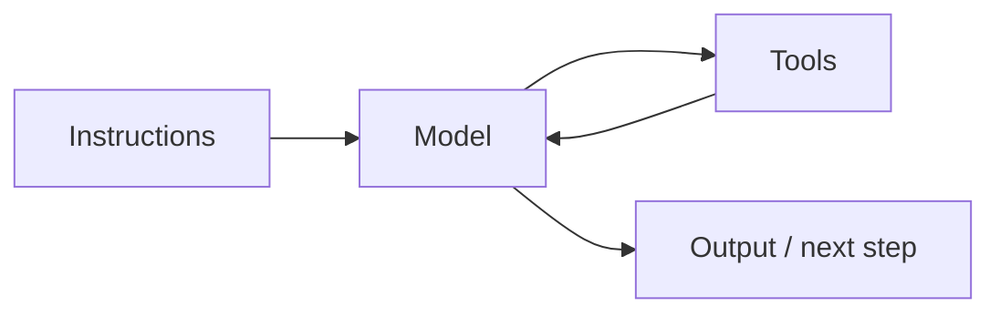

# Agent Architecture: Core Agent Components

**Overview:** Understand the foundational components in AI agent architecture—models for decision-making, tools for real-world interaction, and instructions that guide behavior—and how they combine into adaptable, scalable systems.

---

Agents are not black boxes. They are systems built from distinct, configurable components—the building blocks of robust agentic AI.

At the center are three foundational elements:

- **The model** — Interprets inputs and reasons through decisions
- **The tools** — Let the agent interact with external systems
- **The instructions** — Guide behavior, communication, and goal priorities

By choosing and combining these thoughtfully, you shape an agent for a specific task, domain, or environment.

## Learning objectives

By the end of this lesson, you will be able to:

- Explain model selection factors
- Describe how tools enable agent action
- Recognize the role of instructions in agent behavior
- Understand how components interact within an agent system

---

## The model: choosing the agent's brain

The model sits at the center of decision-making. Given a user prompt or observed event, it:

- Understands what is being asked or required
- Decides steps or actions toward a goal
- Chooses whether to act directly or invoke a tool
- In advanced setups, evaluates whether past decisions succeeded

**Reflection / self-critique** is a powerful pattern: the model critiques its own plans or tool outputs and loops back to correct them—making agents more robust and adaptive.

### Why LLMs work as agent brains

Most agents today use LLMs because they are:

- **Flexible** — Wide variety of tasks in natural language
- **Compositional** — Break tasks into subtasks and multi-step reasoning chains
- **Adaptable** — Generalize to new domains without retraining

**Example prompt:** *"Book me the earliest flight from Seattle to New York tomorrow morning and notify my assistant."*

The model identifies subtasks (booking + notification), plans tool/API calls, and composes messages.

### Model selection factors

Do not default to the largest model. Match the model to task, latency, cost, and context needs.

| Factor | Guidance |
|--------|----------|
| **Task complexity** | Simple extraction/summarization → smaller models (Mistral, Gemma). Planning, judgment, creativity → GPT-4, Claude Opus, etc. |
| **Latency** | Live chat and interactive tools → low-latency models |
| **Cost** | Frequent requests → cost per query; mix small models for routine steps and large models when needed |
| **Context length** | Long conversations or documents → extended context (e.g., Claude Sonnet, Gemini 1.5) |

Thoughtful model choice keeps the agent responsive, affordable, and aligned with its purpose. The model is the brain—but it needs the right setup to perform well.

---

## The tools: acting in the environment

The model thinks; **tools** act. A tool is any external function, API, or environment the agent uses for real-world tasks.

Tools let the agent do more than generate text—interact with systems, gather live data, and change its environment.

**Common tool types:**

- APIs (weather, email, calendar)
- Web search
- Code execution
- Databases
- Device or robotic interfaces

**Example:** *"Check tomorrow's weather and message me if it looks rainy."*

1. Call weather API with location and date
2. Parse forecast; decide if rain is expected
3. Send alert via messaging API

Without tools, the agent only simulates the task in text. With tools, it completes the request in production workflows.

---

## The instructions: shaping agent behavior

Even with a strong model and tools, an agent needs **clear instructions**. Instructions are directives and context you provide to shape behavior—not a separate runtime component like a tool.

They bridge raw capability and purposeful behavior: responses, decisions, and boundaries.

**Forms instructions can take:**

- Natural language task prompts
- System messages defining role and personality
- Few-shot examples for scenarios
- Ethical or formatting constraints
- Task definitions (*summarize*, *extract entities*, *use tool A if X*)

Crafting instructions through prompts and system messages is **prompt engineering**—a critical skill for LLM-powered agents.

**Example system prompt:**

> You are a helpful support assistant. Always respond politely, and escalate issues if the user sounds frustrated.

This shapes how future inputs are interpreted—not a one-off task.

**Well-crafted instructions:**

- **Align output with expectations** — Tone, role, priorities
- **Guide reasoning and tool use** — Step-by-step vs. direct answer changes behavior
- **Control safety** — Limits and ethical boundaries reduce undesired actions

You need not hard-code every decision. Instructions act as the agent's compass.

---

## How components work together

Models, tools, and instructions interact constantly:

1. **Instructions set the stage** — Role, goals, boundaries
2. **The model thinks** — Interprets input, reasons, decides next step
3. **Tools handle doing** — Retrieve data, send messages, trigger processes

This may loop until the task completes. The pattern stays the same: **guided reasoning (model), purposeful action (tools), alignment (instructions).**

### Why modular design?

Structuring agents around model, tools, and instructions supports:

- **Flexibility** — Swap or upgrade models without rebuilding everything
- **Extensibility** — Add tools without redesigning the core
- **Adaptability** — Adjust instructions for new domains or requirements
- **Debuggability** — Isolate failures to specific components
- **Resilience** — Fault in one module need not collapse the whole agent

This modularity enables advanced patterns—chaining, routing, multi-agent orchestration—covered in later lessons.

### Walkthrough: scheduling a meeting

**User:** *"Set up a meeting with Sarah next week to discuss the roadmap."*

| Step | What happens | Components |
|------|--------------|------------|
| Perceive and plan | Parse instruction; plan sub-steps | Model, instructions |
| Gather information | Query calendars | Tools (Calendar API) |
| Execute action | Format and send invite | Tools (Email API), model |
| Confirm completion | Check invite status; confirm to user | Tools, model |

---

## Summary

Every AI agent relies on three key components:

- **Model** — Reasoning and planning
- **Tools** — Action in the external world
- **Instructions** — Role, tone, and boundaries

Design each carefully and ensure they work together so the agent acts intelligently, adaptively, and safely.

**Previous:** [← Introduction to AI Agents](./01-introduction-to-ai-agents.md) · **Next:** [Component Interaction and Memory →](./03-component-interaction-and-memory.md)
