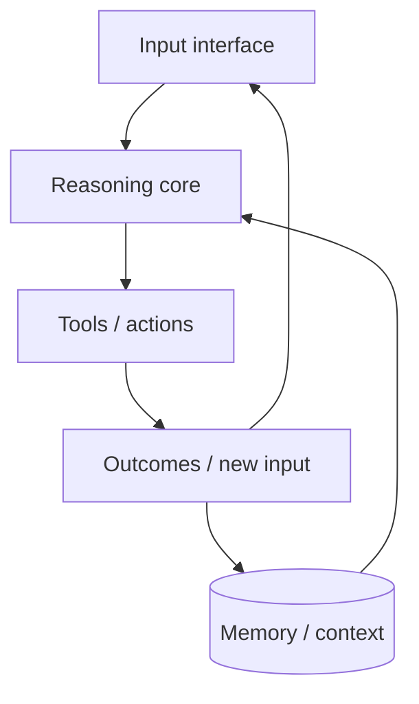

# Agent Architecture: Component Interaction and Agent Memory

**Overview:** Learn how agents integrate perception, reasoning, memory, and actions to operate coherently over time—and how environmental sensing and memory systems support continuous, context-aware behavior.

---

In the previous lesson we covered the three core components: **model**, **tools**, and **instructions**. A functioning agent also needs to **perceive** its surroundings and **remember** what happened.

This lesson expands from individual components to complete agent systems: environmental sensing, memory, and the workflow that drives interaction over time.

## Learning objectives

By the end of this lesson, you will be able to:

- Identify how memory and perception extend basic agent functionality
- Understand where memory and sensing occur in the reasoning loop
- Explain how external retrieval (e.g., vector databases) supports long-term behavior
- Recognize how real-world agents use these capabilities adaptively

---

## The architecture blueprint

Think of agent architecture as a **control flow** connecting four primary elements:

| Element | Role |
|---------|------|
| **Input interface** | Receives text, sensor data, API signals, or multimodal input |
| **Reasoning core (model)** | Interprets input, plans steps, selects tools—guided by instructions |
| **Tools and actions** | APIs, documents, responses, or physical actions |
| **Memory and context** | Conversation history, retrieved documents, user preferences |

Advanced systems add specialized layers (safety, monitoring)—covered in later lessons.

The system operates in a **loop**: receive input → reason → act → observe → continue. Reasoning depends on perception and memory; actions influence future inputs; memory connects past and present.

Designing this loop thoughtfully yields agents that learn from interaction, adapt to context, and behave consistently over time.

---

## Environmental sensing: giving agents perception

To respond intelligently, an agent must first perceive what is happening. **Environmental sensing** makes agents reactive, adaptable, and grounded in the real world.

Traditional systems often used structured inputs (forms, fixed commands). Modern agents interpret natural language, images, audio, and data streams.

**Capabilities unlocked by sensing:**

- **Context awareness** — Prior commands, document contents, device state
- **Multimodal interaction** — Voice, images, live streams
- **Dynamic reactivity** — Monitor changes and respond proactively

### Examples in practice

- Virtual assistant: STT for voice + calendar text
- Support agent: OCR/vision on uploaded screenshots
- Factory agent: sensor readings → adjust machines in real time
- Document agent: read PDFs/spreadsheets to answer questions

Perception expands reach: the agent must observe, not only reason and act.

### Where perception happens

At the **start of the loop**, raw input becomes signals for reasoning:

- Speech → text
- Image → OCR
- API → parsed JSON
- Natural language → intent

Different models or tools may handle each conversion; the goal is always the same: **meaningful signals for the next decision.**

---

## Memory systems: how agents remember and retrieve

Multi-step behavior requires memory. Without it, every turn feels disconnected—the agent cannot recall prior questions, actions, or retrieved facts.

Memory helps agents:

- Stay coherent in multi-turn conversations
- Avoid repeating questions or actions
- Decide based on prior observations
- Maintain progress toward goals

**Example:** *"Book the same hotel as last time."* Without memory, the agent asks again or gives a generic answer.

### Three common memory types

#### Short-term memory

Recent context within a session—what was just said or done.

- Remembers messages from a few turns ago
- Tracks follow-ups and clarifications
- Often implemented via context windows or in-session buffers

#### Long-term memory

Persists across sessions:

- User preferences and settings
- Past decisions and outcomes
- Historical interactions and completed tasks

Requires explicit storage—often databases.

#### External / knowledge memory

Lookup from outside the model:

- Search a knowledge base
- Retrieve matching documents
- Pull facts from APIs

**Retrieval-augmented generation (RAG)** and **vector databases** are central here. Embeddings enable semantic search so agents retrieve relevant snippets without loading entire knowledge bases or relying on exact keywords.

### How memory operates in the loop

Memory supports the agent at multiple points:

- **Before reasoning** — Prior messages, preferences, related documents
- **During decision-making** — Memory in the context window; avoid repetition; personalize
- **After action** — Store new input, API results, feedback for future turns

The loop of **sense → recall → decide → act → remember** enables effective behavior in evolving environments.

---

## Putting it all together: the complete agent loop

| Step | Description |
|------|-------------|
| **1. Perceive** | User message, file, or sensor input → understandable form |
| **2. Recall** | Past interactions, vector DB lookup, background knowledge |
| **3. Reason and plan** | Intent, subtasks, tool selection |
| **4. Act** | API calls, messages, file updates, physical steps |
| **5. Store and learn** | Persist new context, feedback, outcomes |

The loop repeats as new input arrives—what makes the system feel coherent and capable over time.

---

## Case study: context-aware customer support

You are designing a support agent for a subscription SaaS platform. It must:

- Handle billing and account queries
- Remember prior support tickets
- Adapt to user tone (e.g., frustration)
- Retrieve knowledge-base documents
- Escalate when dissatisfaction patterns emerge

Core components are in place (LLM, APIs, system prompt). In production you see:

1. Repeats questions already answered in the chat
2. Fails to mention recent tickets
3. Generic answers despite relevant FAQs
4. Stays overly cheerful when users are angry; no escalation

### Discussion questions

**Question 1:** For each issue above, which blueprint element is failing—Input Interface, Reasoning Core, Tools/Actions, or Memory/Context?

Guidance

Issues 1, 2, and 3 primarily indicate **Memory/Context** failures (short-term session memory, long-term ticket history, external FAQ retrieval). Issue 4 involves **Reasoning Core** (instructions/tone policy) and possibly **Tools/Actions** (missing escalation tool or trigger).

**Question 2:** A user says, *"I'm still having the same issue I reported yesterday."* Which step in Perceive → Recall → Reason → Act → Store bridges sessions, and what memory type is needed?

Guidance

**Recall** (before reasoning) must pull **long-term memory**—stored ticket history or prior session summaries—not just the current chat window.

---

## Summary

Agents need more than a model and tools: **perception** grounds them in reality; **memory** gives continuity across turns and sessions.

The architecture blueprint—input, reasoning, tools, memory—forms a loop that drives adaptive, intelligent behavior over time.

**Previous:** [← Core Agent Components](./02-core-agent-components.md) · **Next:** [Agent Orchestration Patterns →](./04-agent-orchestration-patterns.md)
