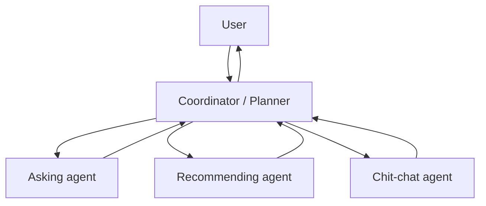

# Introduction to MACRS and the Design Challenge

**Overview:** Explore how MACRS uses a multi-agent architecture to improve goal-directed dialogue in conversational recommender systems. Learn to balance fluency and control by coordinating specialized agents for planning, strategy, and user adaptation.

---

## Problem space: goal-directed dialogue in CRS

Recommender systems shape how we choose movies, products, and restaurants. Static interfaces (sliders, forms, fixed suggestions) are giving way to **conversational recommenders**—AI assistants users talk to in natural language.

At first glance, LLMs seem ideal: fluent, versatile, coherent. Many **LLM-only conversational recommender systems (CRSs)** use a single model for everything—eliciting preferences, recommending items, and keeping the user engaged.

### The hidden flaw

LLMs excel at free-form dialogue, but **goal-directed conversation** is different. The system must guide the user toward a specific outcome (e.g., a successful recommendation). LLMs lack explicit planning and robust state management over long conversational horizons.

Unlike open-ended chatbots, a CRS has a clear objective:

- Gather enough preference data
- Find relevant recommendations
- Present them persuasively
- Keep the user engaged throughout

That requires balancing **information elicitation**, **recommendation**, **conversation management**, and **strategy refinement** at once.

**Traditional CRSs** (pre-LLM) used hard-coded pipelines, slot-filling, and finite-state machines. They could guide users toward a goal but felt **rigid and brittle**—unexpected or nuanced input often broke them.

**LLM-only CRSs** improvise well but lack structure in planning, memory, and strategic control. Dialogue may sound good yet fail to progress, lose track of preferences, or repeat itself.

### Comparing approaches

| Approach | Strengths | Weaknesses |
|----------|-----------|------------|
| **Traditional CRSs** | Goal-oriented, structured logic | Rigid, low adaptability |
| **LLM-only CRSs** | Fluent, flexible conversations | Poor control, inconsistent planning |

**MACRS** (Multi-Agent Conversational Recommender System) merges both worlds: the **strategic planning** of traditional systems and the **generative fluency** of LLMs.

---

## Introducing MACRS

Instead of one general-purpose agent juggling every aspect of conversation, MACRS employs a **team of specialized agents** that collaborate to manage dialogue strategically.

The design applies agentic principles:

- Assign roles
- Align goals
- Coordinate behavior
- Learn from experience

MACRS exemplifies a **modular agentic architecture** with an explicit control loop for dialogue flow. It addresses multi-agent coordination costs through **structured planning and reflection**.

---

## Design dilemma: one agent or many?

If you were building a conversational recommender, how would you structure it?

**Single-agent route:** Feed full dialogue history into one LLM and prompt it to ask questions, recommend, or chit-chat. Many LLM-based CRSs work this way today.

**Multi-agent route:** Different agents for different roles—one gathers preferences, another proposes items, a third keeps conversation natural. A **central coordinator** decides which response to surface.



| | Single-agent | Multi-agent |
|---|--------------|-------------|
| **Simplicity** | Easier to build | Requires orchestration |
| **Complex tasks** | Brittle when complexity grows | More structured and modular |
| **Robustness** | Limited | Stronger with careful design |

MACRS chose **multi-agent**—for good reason.

---

## Why go multi-agent?

The challenge in CRS design is not just fluency—it is **dialogue control**. The system must reason over:

- What the user already said
- What information is still missing
- Which strategy to follow (probe, recommend now, or delay)
- How to stay engaged when no immediate recommendation is possible

Encoding all of this in one prompt or context window becomes unmanageable. MACRS **distributes competing goals** across agents with complementary expertise.

This implements **decomposition and specialization**—core agentic design principles. It also uses the **Manager-Worker orchestration pattern**: a central planner coordinates specialized responder agents.

### Single-agent vs. multi-agent in CRS

| Feature | Single-agent LLM | Multi-agent MACRS |
|---------|------------------|-------------------|
| **Fluency** | ✅ | ✅ (via LLMs) |
| **Modular roles** | ❌ | ✅ |
| **Explicit strategy** | ❌ | ✅ (via planner) |
| **Memory separation** | ❌ | ✅ |
| **Ease of debugging** | ❌ | ✅ (agent-level) |

MACRS reframes conversational recommendation from a **monolithic agent** to a **collaborative system of specialists**—distribute responsibility, coordinate toward a shared goal.

---

## Design goals for conversational recommendation

What makes a recommendation conversation actually helpful? MACRS is built to:

1. **Switch conversation styles** — Ask questions (*"Do you like action movies?"*), recommend (*"You might enjoy Inception"*), and stay friendly (*"That's a great choice!"*)—blended naturally.

2. **Learn from behavior** — Skipping scary movies signals dislike even without *"I don't like horror."* MACRS adjusts strategy from implicit feedback.

3. **Decide what to say** — One part may want more questions; another is ready to recommend. MACRS picks the smartest next move.

4. **Remember what matters** — Comedy preferences from earlier in the chat—or last week—stay in play.

5. **Keep the conversation on track** — The system guides step-by-step toward a choice the user will actually make, not endless chat.

The next lessons show how MACRS's multi-agent design tackles each need in a coordinated way.

---

## Overview of the MACRS system architecture

MACRS addresses goal-directed dialogue with two essential, dynamically interacting modules:

```mermaid
flowchart LR
    subgraph planning [Multi-agent act planning]
        R1[Responders] --> P[Planner]
        P --> OUT[Response to user]
    end
    OUT --> FB[User feedback]
    FB --> subgraph reflection [User feedback-aware reflection]
        IL[Information-level]
        SL[Strategy-level]
    end
    IL --> MEM[(Shared memory)]
    SL --> MEM
    MEM --> R1
    MEM --> P
```

### 1. Multi-agent act planning framework

Controls dialogue flow by choosing the most suitable **conversational act** each turn. Specialized agents generate options; planning selects the best response.

### 2. User feedback-aware reflection mechanism

A dynamic optimization module. MACRS learns from user interactions—acceptance, skips, disengagement—and refines understanding and strategy.

### The improvement cycle

1. Act planning generates a response
2. The user reacts
3. Reflection observes the reaction (*accepted*, *skipped*, etc.)
4. Planning strategy and responder behavior update for the next turn

This iterative loop optimizes dialogue flow and recommendation accuracy over the course of a conversation.

Upcoming lessons cover act planning and reflection in detail.

---

## Summary

Goal-directed conversational recommendation needs **control**, not just fluency. LLM-only CRSs struggle with planning and state; traditional CRSs struggle with adaptability.

MACRS uses **multi-agent architecture**, **centralized planning**, and **feedback-aware reflection** to bridge that gap.

**Next:** [Multi-Agent Act Planning Framework →](./02-multi-agent-act-planning-framework.md)

**Previous:** [Module 1: Challenges and Design Strategies](../01-agent-design-fundamentals/06-challenges-and-design-strategies.md)
