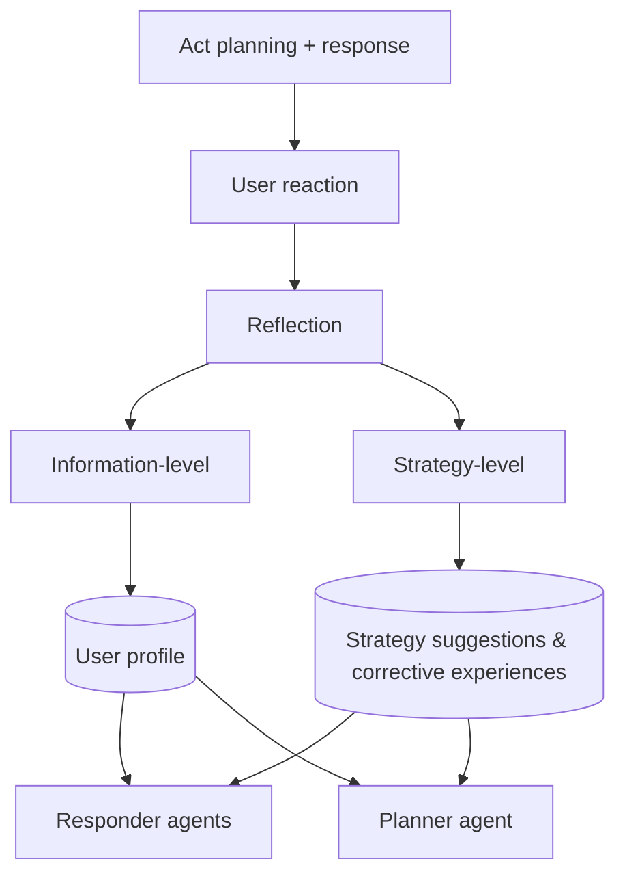
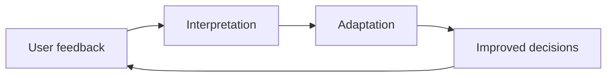

# MACRS User Feedback-Aware Reflection Mechanism

**Overview:** Explore MACRS's reflection mechanism for real-time adaptation—how it analyzes user behavior and failed interactions to update profiles and dialogue strategies during a conversation.

---

Even with good planning, conversations do not always go as expected.

The assistant asks the right questions and suggests a matching movie. The user **skips it without responding**—or closes the chat.

What happened?

Maybe the tone felt robotic. Maybe the movie was right on paper but wrong for the mood. Maybe the user had just seen that title elsewhere.

A **fixed system** would try again similarly, unaware it is frustrating the user.

Goal-directed dialogue changes mid-conversation. Preferences evolve. Users respond indirectly. What worked moments ago may fail now.

A well-designed agentic system must **reflect on how moves are received** and adjust—not only plan them.

MACRS does this through its **user feedback-aware reflection mechanism**. Failed recommendations and skipped responses become **learning opportunities**, not dead ends.

Reflection is handled by distinct **LLM-based critic/evaluator components**. They analyze conversation performance and generate structured feedback for responder and planner agents—operating in a feedback loop that feeds back into act planning.

MACRS observes user reactions and adjusts understanding and behavior—**learning mid-conversation** is what makes it feel responsive.

---

## Two levels of reflection

| Level | Focus |
|-------|--------|
| **Information-level** | Refine *what* the user wants |
| **Strategy-level** | Adjust *how* the system chooses to act |

Updates happen **in real time within the session**—influencing subsequent turns by updating agents' memory modules (user profiles, strategy suggestions, corrective experiences). This is **in-session adaptation**, not retraining underlying models or system-wide re-weighting.

---

## Information-level reflection: learning what the user wants

Users often express preferences **indirectly**. They may not say *"I like romantic comedies,"* but browsing and skipping tell a clearer story.

Information-level reflection uses **behavioral feedback** to sharpen understanding—not only explicit statements.

### Signals tracked

- **Browsing behavior** — Clicks, skips, time on items
- **Response patterns** — Answered, ignored, or changed topic
- **Engagement signals** — Responsive, passive, or disengaged turns

Each signal is **digital body language** about what matters now.

### How it helps

MACRS updates a **structured user profile**—evolving preferences, interests, constraints—shared with all three responder agents.

| Agent | Adaptation example |
|-------|-------------------|
| **Asking** | Stop repeating questions about avoided genres |
| **Recommending** | Prioritize items similar to engaged-with content, even if never mentioned |
| **Chit-chat** | Reference recently viewed content to stay relevant |

Information-level reflection shifts from *"What did the user say?"* to *"What has the user shown us through behavior?"*

---

## Strategy-level reflection: learning from failure

Understanding the user better does not automatically fix a **bad strategy**. What if a recommendation is rejected? Or the conversation stalls without enough preferences?

**Strategy-level reflection** teaches MACRS *how* to talk more effectively in future turns.

### Step 1: Detecting failure patterns

Monitored signals include:

- Recommendation rejection (skip, dislike)
- User disengagement (short or vague replies)
- Repetitive dialogue without progress

**Hybrid failure detection:**

| Approach | Use case |
|----------|----------|
| **Rule-based triggers** | Fast checks for explicit negatives (*"no"*, *"wrong"*, *"that's not what I want"*) |
| **Model-based classification** | Subtle disengagement, sentiment shifts, lack of progress |

### Step 2: Generating agent feedback

When failure is detected, MACRS uses the LLM to produce:

- **Strategy suggestions for responders** — e.g., avoid generic *"What do you like?"*; use context-aware prompts from browsing history
- **Corrective experiences for the planner** — Insights about plan/agent choices that led to failure, to avoid repeating them

Reflections are grounded in **conversation history and outcomes**—specific and actionable.

### Step 3: Updating the dialogue plan

Reflections adjust future behavior:

- Asking agent probes more specifically
- Recommending agent steers toward safer fallbacks
- Planner prioritizes engagement over aggressive recommendation

Adaptation is achieved by **dynamically modifying context and instructions** in agents' prompts for subsequent turns—updated profiles, strategy suggestions, and corrective experiences feed into the LLM inputs.

Failures become **fuel for adaptation** within a single conversation—not hardcoded rule changes.

---

## Comparing the two reflection layers

Both learn from feedback but at different levels of abstraction.

| Aspect | Information-level | Strategy-level |
|--------|-------------------|----------------|
| **Purpose** | Understand what the user wants | Improve how the system behaves |
| **Input** | Clicks, skips, behavior patterns | Failures, disengagement, negative feedback |
| **Output** | Updated user profile | Adjusted tactics (suggestions, corrections) |
| **Primary target** | Responder agents | Responders + planner |
| **Timescale** | Ongoing personalization in session | Adaptive refinement within/across turns |

Together they form a **closed-loop learning system**:

- One loop tunes **content** by better modeling the user
- One loop improves **method** by learning from missteps

Dual reflection makes the system **strategically self-improving** even in one session.

---

## Summary: the feedback-aware reflection pattern

From an agentic design perspective, this pattern enables agents to:

- **Self-improve in real time** — Adjust from interactions, not static rules alone
- **Handle dynamic environments** — Respond to unexpected behavior and evolving preferences in-session
- **Enhance trustworthiness** — Learn from errors and align with user needs over time

Reflection in MACRS is not post-hoc analysis—it is **part of the agent workflow**.

> **Core principle:** Good agents don't just act—they **reflect**. The best agentic systems are fluent, capable, and self-aware in their decision-making.

**Next:** [Evaluating MACRS: Performance and Insights →](./04-evaluating-macrs-performance-and-insights.md)

**Previous:** [← Multi-Agent Act Planning Framework](./02-multi-agent-act-planning-framework.md)
