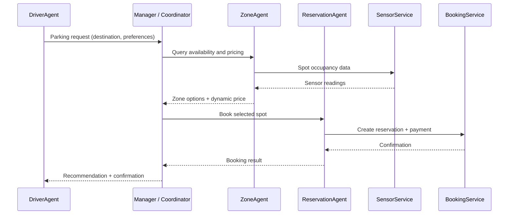

# Thought Exercise: Design a Smart Parking Agent System

Transform a traditional modular smart parking service into a proactive multi-agent system. Work through agent internal logic, orchestration patterns, and safety guardrails to design for scalability, reliability, and ethical behavior.

**Prerequisites:** [Module 1: Agent Design Fundamentals](./modules/01-agent-design-fundamentals/README.md)

---

## Starting point: a reactive microservices system

Assume a modern smart parking platform built on **microservices**. It is scalable and resilient, with separate services for specific jobs:

| Service | Responsibility |
|---------|----------------|
| **SensorService** | Real-time data on which spots are occupied |
| **BookingService** | Reservations for specific spots |
| **UserService** | User profiles and payment information |
| **NotificationService** | Alerts to users |

Each service waits to be called by central application logic and performs its defined task. The system handles simple, direct requests efficiently—but it is **reactive, not proactive**.

---

## The need for agency

This design struggles with complex, dynamic, user-centric problems. A traditional modular architecture meets these needs only by piling on brittle rules—or by evolving into **goal-oriented, autonomous agents**.

| Need | Limitation of reactive services |
|------|----------------------------------|
| **Proactive assistance** | Cannot anticipate needs—e.g., reroute a driver when traffic jams near their destination |
| **Complex reasoning** | Cannot combine real-time demand, local events, and history to adjust pricing dynamically |
| **Personalized experience** | May suggest the closest spot but not reason that a user prefers cheaper, covered parking |
| **Robust error handling** | A failed sensor reports an error but cannot infer status from nearby sensors or mark a zone unreliable |

Hard-coded rules for every scenario are brittle and hard to maintain. **Agentic architecture** fits when the system must move beyond fixed rules into autonomous, goal-oriented reasoning.

The diagram below illustrates how agents might interact during a typical parking request:

---

## Part 1: Centralized or decentralized?

Before designing individual agents, choose a **high-level multi-agent orchestration strategy**. Drivers, sensors, and reservations must coordinate.

- **Centralized (Manager-Worker):** A single manager agent coordinates all others. Strong control; potential single point of failure.
- **Decentralized (handoffs):** Specialized agents communicate as peers. More resilient; harder to debug and observe.

### Question 1

As the architect, which high-level orchestration pattern would you choose for this system, and why? Justify your decision using **scalability**, **fault tolerance**, and **observability**.

---

## Part 2: Designing internal agent logic

With a high-level plan in place (many designs use a **hybrid** centered on a manager agent), define how each agent **perceives, reasons, and acts**.

Evolve existing services into intelligent agents. Use the four-part architecture from Module 1: **input interface**, **reasoning core**, **tools**, and **memory**.

### Question 2 (a): DriverAgent

Design the **DriverAgent**—the agent that interacts directly with the user.

Describe:

- What data or events **trigger** it to act
- What kind of **reasoning** it performs
- What **tools** it uses (APIs to underlying services)
- What it must **remember**

Focus on user interaction and proactive assistance.

### Question 2 (b): ZoneAgent

Design the **ZoneAgent**, responsible for a specific geographic parking zone.

Describe:

- Triggers
- Reasoning (availability, pricing, local events)
- Tools (e.g., SensorService, event feeds, pricing APIs)
- Memory (historical occupancy, pricing decisions, reliability flags)

### Question 2 (c): ReservationAgent

Design the **ReservationAgent**, which handles booking and payment.

Describe:

- Triggers
- Reasoning (verify user, validate slot, process payment)
- Tools (BookingService, UserService, payment APIs)
- Memory (pending transactions, confirmation state, audit trail)

Focus on tools and memory needed for a **secure transaction**.

---

## Part 3: Choosing orchestration patterns

Define how each agent structures its **internal workflow**. Different agents may need different patterns—tool loops, ReAct, or plan-and-execute.

### Question 3 (a): DriverAgent pattern

Which **internal orchestration pattern** would you choose for the DriverAgent? Justify how it fits an interactive, user-facing role.

### Question 3 (b): ZoneAgent pattern

The ZoneAgent responds to manager requests by querying sensors, checking local events, and applying dynamic pricing. Which internal pattern best fits this **multi-step, data-driven** workflow? Justify your choice.

### Question 3 (c): ReservationAgent pattern

The ReservationAgent handles verifying the user, processing payment, and confirming the reservation. Which internal pattern best fits this **transactional** workflow? Justify with emphasis on **transactional integrity**.

---

## Part 4: Designing safety guardrails

Increased autonomy brings real-world risk: double-booking, leaking location history, or pricing errors.

Design guardrails so safety is a **core requirement**, not an afterthought.

### Question 4

Describe **at least two specific guardrails** for the smart parking system. For each guardrail:

1. **Identify the risk** it prevents (e.g., privacy, financial, safety)
2. **Explain the technical safeguard** you would implement
3. **Specify which agent(s)** enforce it

Draw on principles from [Guardrails and Human Oversight](./modules/01-agent-design-fundamentals/05-guardrails-and-human-oversight.md): input/output filters, PII protection, tool-use safeguards, human approval gates, and audit logging.

---

## Wrap-up

Working through these questions moves a standard modular parking system toward a **resilient, trustworthy multi-agent design**. The same principles—role clarity, orchestration, memory, guardrails, and human oversight—apply beyond parking to any domain that needs proactive, goal-directed autonomy.

**Related lessons:**

- [Agent Orchestration Patterns](./modules/01-agent-design-fundamentals/04-agent-orchestration-patterns.md)
- [Component Interaction and Memory](./modules/01-agent-design-fundamentals/03-component-interaction-and-memory.md)
- [Guardrails and Human Oversight](./modules/01-agent-design-fundamentals/05-guardrails-and-human-oversight.md)
